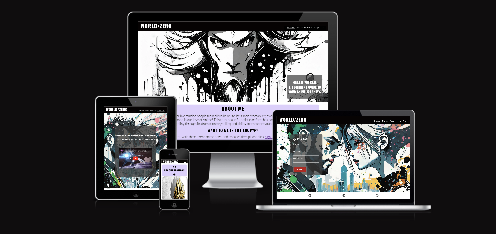
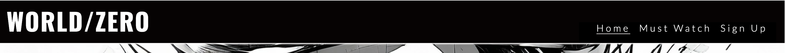
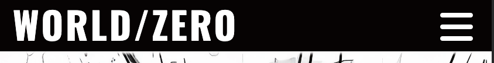
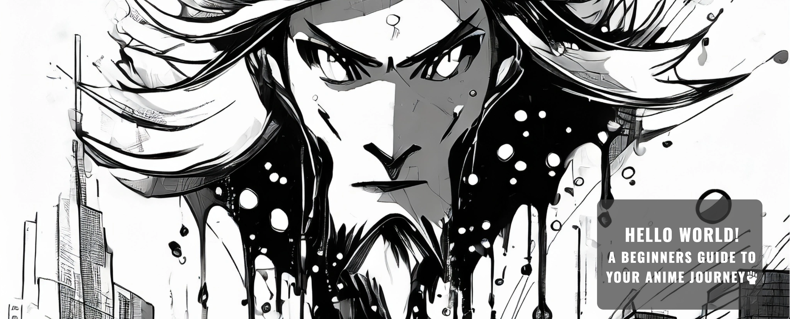
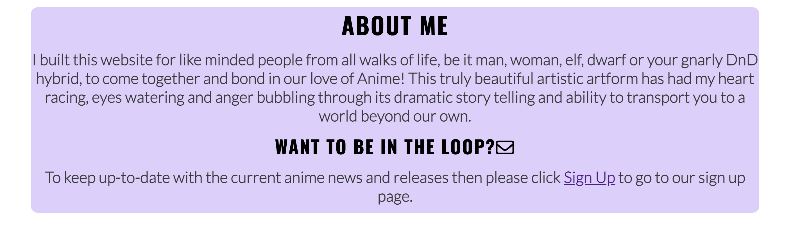
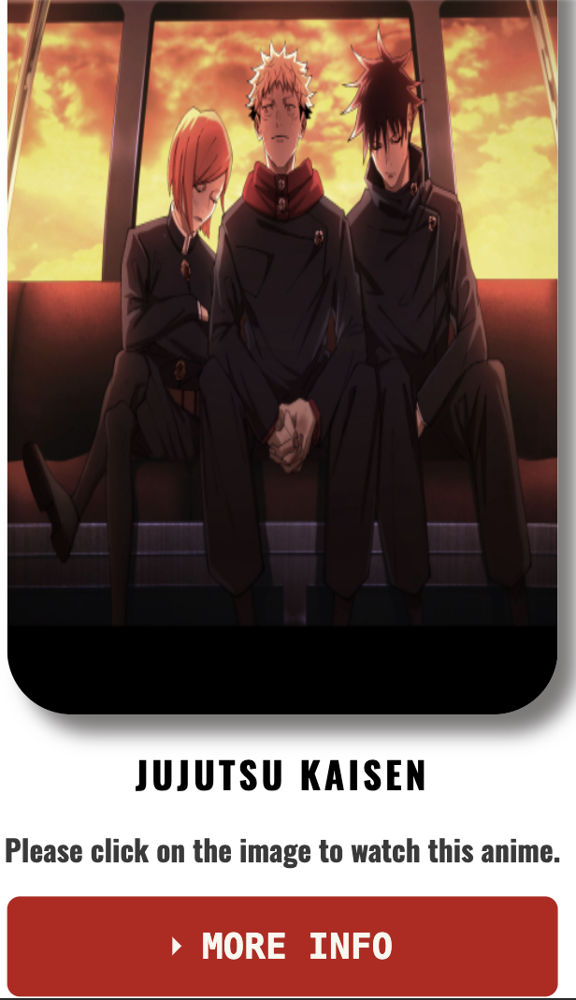
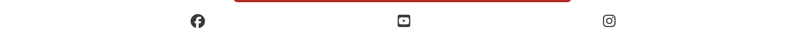

# World/Zero

## Welcome Assesor-sensei,

This is my website detailing some of my love for anime and introducing this art form to any potential visitors to my website. On the home page I have displayed a unique image in a common anime/japanese brush style detail and a small intro welcoming visitors to this site. I detail why I built this site and make reference to common geek terminology to welcome similarly like minded people to make them comfortable. At the bottom of this page I have listed two current anime I am watching and a description of each anime for visitors understanding. I have also outlined a reason to sign up to my page and added a link that will open the sign app page for visitors to sign up for a monthly newsletter.

On the next page I have laid out 6 anime I recommend watching, including a description of the anime and reasons to watch at the bottom of this page I have linked a button that will bring visitors to a new web page with a free resource to watch these anime and many more.

On the sign up page there is a form to sign up to a monthly newsletter that once their information has been provided will open an identical page welcoming them to this community and will provide a YouTube video to some anime fight/transition scenes.

## Features
### Navigation Bar
This navigation bar code was taken from the Love Running walkthrough projectand I modified the content and the color scheme to match my websites aesthetic.

- Large screens

- Small screens

### Hero Section

This section contains my unique image generated by AI Adobe Firefly, I used this image as my Hero landing page image. This style of srt is reminiscent of Japanese style brush strokes and I beleved it connects the aim of this website to its original heritage. This section also contains a brief welcome to my website, using Hello World as a homeage to the tradition of developers first website.

### About Me

This section lays out a brief explanation of who this website is for and why I created it. I use language in this section recogniseable to the target audience of geeks and gamers. While not always the case the majority of the 'Geek' community would be both interested in video games and anime and I hope to connect to those who have only just " dipped their toes in " and give them a starting point to their anime journey. My mentor while not an avid fan as myself expressed his interest in using this site to get into anime previously unknow to him.
This section also contains a link to the Sing Up page to be join a newsletter yet to be implemented so that visitors can learn even more about anime.

### Current Watch Section
This section contains an image and a drop down menu of an anime I am currently watching. The image is also a link to a freely accessible website that will open in a new page on the first episode of this anime.

### Footer

This is my footer section where I have copied the code from the Love Running project with inks to  3 social media platforms tht open in a new tab.

### Must Watch Section

This section of my website lays out 6 anime I have selected as my reccomendations to watch. Each anime has a drop down menu that will privude more information about the anime I have suggested and each image is a link to a website that will open in a new page on episode 1 of that anime. This section is responsive on small and large screens.
!

## Validator Testing

 HTML and CSS
- No errors were returned when passing through the official https://validator.w3.org/
CSS
- No errors were found when passing through the official https://jigsaw.w3.org/css-validator/validator

## BUGS:
I ran into many bugs with my website many of which were related to styling elements correctly or troubleshooting code that did not do what I intended.

## Credits:
I took much inspiration from the Love Running project for some design aspects of this website such as the. Nav bar and footer as well as the sign up form design While I made changes to this code for my own design ideas
I used an AI image generator to create several potential pictures including the background images for this website. I used Adobe Firelfy to create these images.
While this website is designed for anime which is already copyritten I used main images for the anime from a website I regularly use called<https://animesuge.to/>  . These images are not my property and are used as a mean to connect site visitors to the respective anime.These images are used for strictly enducational purposes only.
I copied the collapsibleHTML and CSS from https://www.digitalocean.com/community/tutorials/css-collapsible and added it to my site changinga couple of colors and sizes.
