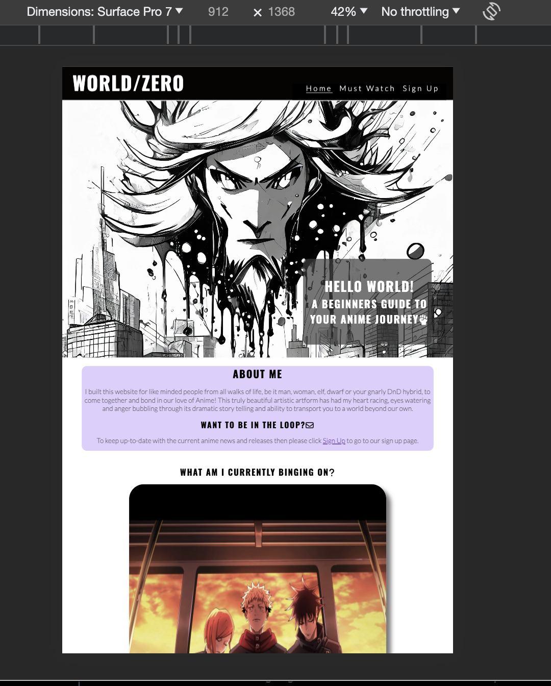

## Welcome Assesor-sensei,

### Website Overview

This is my website detailing some of my love for anime and introducing this art form to any potential visitors to my website. On the home page, I have displayed a unique image in a common anime/Japanese brush style detail and a small intro welcoming visitors to this site. I detail why I built this site and make reference to common geek terminology to welcome similarly like-minded people to make them comfortable. At the bottom of this page, I have listed two current anime I am watching and a description of each anime for visitors understanding. I have also outlined a reason to sign up for my page and added a link that will open the sign-up app page for visitors to sign up for a monthly newsletter.

On the next page, I have laid out 6 anime I recommend watching, including a description of the anime and reasons to watch at the bottom of this page I have linked a button that will bring visitors to a new web page with a free resource to watch these anime and many more.

On the signup page, there is a form to sign up for a monthly newsletter that once their information has been provided will open an identical page welcoming them to this community and will provide a YouTube video of some anime fight/transition scenes.

## Features
### Navigation Bar Section
This navigation bar code was taken from the Love Running walkthrough project and I modified the content and the colour scheme to match my website aesthetic.

- Large screens

- Small screens

### Hero Section

This section contains my unique image generated by AI Adobe Firefly, I used this image as my Hero landing page image. This style of srt is reminiscent of Japanese style brush strokes and I believe it connects the aim of this website to its original heritage. This section also contains a brief welcome to my website, using Hello World as a homage to the tradition of developers’ first website.

### About Me Section

This section lays out a brief explanation of who this website is for and why I created it. I use language in this section recognisable to the target audience of geeks and gamers. While not always the case, most of the ‘Geek’ community would be interested in video games and anime and I hope to connect to those who have only just " dipped their toes in " and give them a starting point for their anime journey. My mentor while not an avid fan like myself expressed his interest in using this site to get into anime previously unknown to him.
This section also contains a link to the Sing Up page to join a newsletter yet to be implemented so that visitors can learn even more about anime.

### Current Watch Section
This section contains an image and a drop-down menu of an anime I watch. The image is also a link to a freely accessible website that will open on a new page on the first episode of this anime.

### Footer Section

This is my footer section where I have copied the code from the Love Running project with inks to  3 social media platforms that open in a new 

### Must Watch Section

This section of my website lays out 6 anime I have selected as my recommendations to watch. Each anime has a drop-down menu that will provide more information about the anime I have suggested and each image is a link to a website that will open on a new page on episode 1 of that anime. This section is responsive on small and large screens.

mustwatch](assets/images/mustwatch.png)

### Sign Up Section

This section contains a unique AI-generated background image using Adobe Firefly. This section contains a form to sign up for a newsletter. This form requests the visitors to provide a username and their " in real life " name (this is also a homage to a popular Iisekai anime term and is also used in gaming to describe something that is in real life and not part of the digital or fantasy world). They must also provide their valid email address. Once they provide this information and press the submit button they will be brought to the next page.

### Thank You Section

After submitting all your information on the Sign-Up page and pressing submit, you are brought to this page. This Thank You page is identical to the Sign Up page however instead of the form there is now a container with a thank you message and an embedded YouTube video of a clip containing scenes from multiple anime and impressive transitions. This video is meant to entice visitors even further for the journey they are about to begin with anime.

### Features Left To Implement
Using media queries I wished to change the layout of both the index and suggestions pages using Flexbox to make the content stretch across the page but it was not within my time constraints.

## Testing

### Manual Testing
I tested my website on multiple screen sizes, browsers and devices. I sent my website out to friends who tested it on their phones. I tested this site on iPhone XR, 11,12, Samsung S10, S20 and Pixel 8. I tested my website on Edge, Chrome, Safari and Firefox, all without issue. 
Here are some screenshots of Dev Tools screen sizes, small, medium and large.
- Small Screen
- iPhone SE

iPhone 12

- Medium Screens
i- Pad Air

  Surface Pro 7

- Large Screens
-Laptop width

### Lighthouse Testing

- index.html

- suggestions.html

- singup.html

- thankyou.html

### Validator Testing

 HTML and CSS
- No errors were returned when passing through the official https://validator.w3.org/
CSS
- No errors were found when passing through the official https://jigsaw.w3.org/css-validator/validator

## Deployment
I followed the same steps as the Love Running project to deploy my PP1 website.

The site was deployed to GitHub pages. The steps to deploy are as follows:
- In the GitHub repository, navigate to the Settings tab
From the source section drop-down menu, select the Master Branch
Once the master branch has been selected, the page will be automatically refreshed with a detailed ribbon display to indicate the successful deployment.
- The live link can be found here - https://seanbyrne5.github.io/world-zero/index.html

## BUGS:
To my knowledge, the only bug I have left unfixed due to time constraints is on the thankyou.html page where after playing the YouTube video on full screen the embedded iframe does not return to its normal position and is moved slightly to the right.
## Credits:
I took much inspiration from the Love Running project for some design aspects of this website such as the Nav bar and footer as well as the signup form design While I made changes to this code for my design ideas

I used an AI image generator, Adobe Firefly to create several potential pictures including the background images for this website. I used Adobe Firelfy, to create these images on the home page and sign up/thank you page. All other images are gathered from Google images as they are not my personal property and are used for educational purposes.

The images used in this website are all connected to a website I use often, called https://animesuge.to, this website is a free resource for all to use and to get hooked on anime. 

These images are not my property and are used as a means to connect site visitors to the respective anime. These images are used for strictly educational purposes only.

I copied the collapsible HTML and CSS from https://www.digitalocean.com/community/tutorials/css-collapsible and added it to my site changing a couple of colors and sizes.

The navbar, footer and ing-up form were also adapted from the Love Running project.

Fonts were imported using Google fonts and were copied from Love Running.
